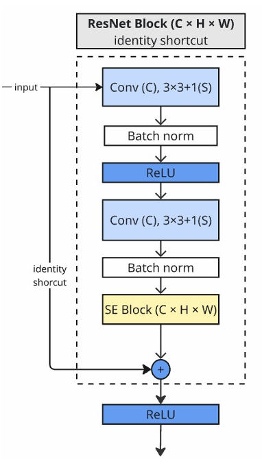
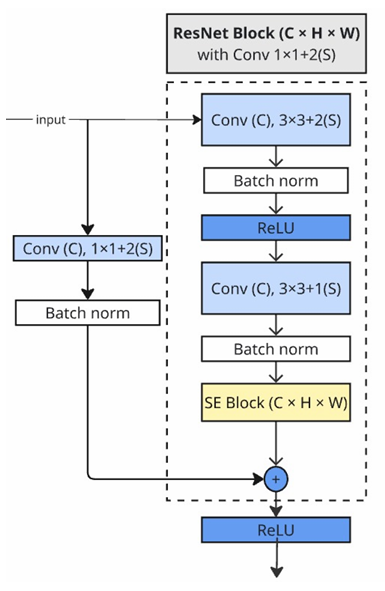

# Arabic Sign Language (ArSL) Classification

A deep learning project for classifying the 28 letters of the Arabic alphabet from hand gesture images, achieving **98.28% test accuracy** using a custom ResNet-18 architecture with Squeeze-and-Excitation blocks.

## 🎯 Overview

This project addresses the communication gap for the deaf and hard-of-hearing community in the Arab world by developing an automated Arabic Sign Language recognition system. The main challenge lies in distinguishing between 28 visually similar hand gestures that represent Arabic letters.

**Key Achievement:** 98.28% test accuracy without transfer learning using our custom ArSL-ResNet architecture.

### Why This Matters

Arabic Sign Language recognition presents unique challenges compared to other sign languages:
- **Visual Similarity:** Many Arabic letters have nearly identical hand shapes (e.g., ZAY vs RAA, SEEN vs SHEEN) that differ only by subtle finger positions
- **Environmental Variations:** Real-world conditions include varying lighting, cluttered backgrounds, and different skin tones
- **No Pre-trained Models:** Unlike English sign language, there are fewer pre-trained models available for Arabic signs, requiring training from scratch

## 🔬 Project Evolution

We explored multiple approaches before arriving at our final solution. Each experiment taught us valuable lessons about the problem domain:

### 1. **MediaPipe Approach** (`notebooks/mediapipe/`)

**Goal:** Use Google's MediaPipe library to detect hand landmarks and extract features.

**What We Tried:**
- Detected 21 hand keypoints (finger tips, knuckles, palm)
- Used landmark coordinates as features for classification
- Attempted to capture hand geometry through skeletal structure

**Results:** Limited success

**Why It Didn't Work:**
- Landmark detection was unreliable with cluttered backgrounds
- Lost spatial context and visual texture information
- Hand pose alone wasn't sufficient to distinguish similar gestures
- Struggled with occlusions and varying hand orientations

**Key Learning:** Raw pixel information contains critical details that landmark abstraction loses.

---

### 2. **Skin Detection** (`notebooks/SkinDetection/`)

**Goal:** Isolate hand regions from background using color-based segmentation.

**What We Tried:**
- Applied HSV/YCrCb color space thresholding
- Attempted to segment hand pixels from background
- Used morphological operations to clean masks

**Results:** Poor segmentation quality

**Why It Didn't Work:**
- Lighting variations drastically affected skin detection thresholds
- Similar colors in background caused false positives
- Lost important context around hand edges
- Required manual threshold tuning for different conditions

**Key Learning:** Color-based segmentation is too brittle for real-world conditions.

---

### 3. **Preprocessing with Enhancement** (`notebooks/03_ArSLHandGesture_CNN_Training.ipynb`)

**Goal:** Improve image quality through preprocessing before training a CNN.

**What We Tried:**
- Image enhancement (contrast, brightness adjustment)
- Automatic cropping to focus on hand region
- Applied same preprocessing to train and test sets
- Trained a standard CNN on enhanced images

**Results:** **96% accuracy** ✅

**The Problem:**
Our instructor pointed out a critical flaw: **We applied preprocessing to the test set.** In real-world deployment, we wouldn't have the luxury of perfect preprocessing on every input image. This created an unrealistic evaluation scenario.

**Key Learning:** Test data must simulate real deployment conditions. Preprocessing both train and test creates an artificial performance boost.

**Code:** The preprocessing functions are in `src/image_preprocessing_enhance.py`

---

### 4. **Raw Data Generalization Test** (`notebooks/04_ArSLHandGesture_CNN_RawData_Generalization.ipynb`)

**Goal:** Test if the model trained on preprocessed data could generalize to raw, unprocessed images.

**What We Tried:**
- Trained CNN on preprocessed/enhanced images
- Removed automatic cropping component
- **Tested on completely raw images** (no preprocessing)
- Measured the generalization gap

**Results:** **92.5% accuracy** ⚠️

**Analysis:**
- 3.5% accuracy drop from previous experiment (96% → 92.5%)
- Demonstrated that the model had learned to rely on preprocessing artifacts
- Model couldn't handle natural variations in lighting and backgrounds
- Proved that train/test distribution mismatch is a serious problem

**Key Learning:** If preprocessing isn't guaranteed at inference time, don't use it during training—or train on raw data instead.

---

### 5. **Final Solution: SE-ResNet with MixUp** (`notebooks/05_ArSL_SE_ResNet_MixUp_Training.ipynb`) ✅

**Goal:** Build a robust architecture that works on raw images and handles visually similar classes.

**What We Tried:**
- Designed custom ResNet-18 architecture from scratch
- Integrated Squeeze-and-Excitation blocks for attention
- Applied MixUp augmentation for smoother decision boundaries
- Trained entirely on raw, unpreprocessed images

**Results:** 
- **95.86% accuracy** without MixUp (already beating preprocessed approach!)
- **98.28% accuracy** with MixUp 🎉

**Why It Worked:**
1. **ResNet architecture** solved vanishing gradients, allowing deeper learning
2. **SE blocks** taught the model to focus on important features (finger positions) and ignore noise (background)
3. **MixUp augmentation** created synthetic examples between similar classes, forcing the model to learn robust boundaries
4. **Training on raw data** ensured the model could handle real-world variations

**Breakthrough Moment:**
The confusion matrix showed perfect classification (F1 = 1.00) for previously problematic classes like ZAY and SEEN after adding MixUp. This was the "aha moment" that solved our visual similarity problem.

---

## 🏗️ Final Architecture

### Overall Architecture Diagram


Our custom ArSL-ResNet consists of three key innovations that work together:

### 1. **Residual Blocks (ResNet-18 Backbone)**

**The Problem They Solve:** Vanishing Gradients

In traditional deep neural networks, gradients get smaller as they backpropagate through layers. By the time they reach early layers, they're nearly zero, so those layers stop learning. This is called the **vanishing gradient problem**.

**The Solution:** Identity Shortcut Connections

ResNet introduces "skip connections" that allow gradients to flow directly backward through the network via an identity mapping (𝑦 = 𝐹(𝑥) + 𝑥). Even if the weight layers suffer from vanishing gradients, the identity path ensures gradient flow.

<div align="center">


</div>

**For ArSL:**
- Identity shortcuts preserve global hand shape and geometry
- Residual paths learn fine-grained finger details
- This dual-focus prevents losing fundamental features as depth increases

**Architecture Details:**
- 4 residual stages with increasing depth: 64 → 128 → 256 → 512 filters
- Each stage contains 2 residual blocks
- Downsampling via stride-2 convolutions when needed

---

### 2. **Squeeze-and-Excitation (SE) Blocks**

**The Problem They Solve:** Channel Importance

Not all feature channels are equally important. Some channels detect finger tips (critical), others detect background texture (noise). Standard CNNs treat all channels equally.

**The Solution:** Channel-Wise Attention

SE blocks learn to weight channels based on their importance for the task:


**How It Works:**
1. **Squeeze:** Global average pooling compresses each 2D feature map into a single number (channel descriptor)
2. **Excitation:** Two fully-connected layers learn channel relationships and output importance weights (0 to 1)
3. **Scale:** Multiply original feature maps by learned weights to amplify useful channels and suppress noise

**For ArSL:**
- Emphasizes channels capturing finger positions and hand edges
- Suppresses channels detecting irrelevant background patterns
- Adapts attention based on each input image (dynamic weighting)

**Mathematical Intuition:**
If a channel consistently activates for discriminative features (like the gap between fingers for SEEN vs SHEEN), the SE block learns to give it higher weight.

---

### 3. **MixUp Augmentation**

**The Problem It Solves:** Overconfident Predictions Between Similar Classes

Our initial model was overconfident—it would predict "ZAY with 99% confidence" even when the image was ambiguous. This caused hard misclassifications on edge cases.

**The Solution:** Train on Interpolated Examples

MixUp creates synthetic training examples by blending pairs of images:

```bash
mixed_image = λ × image_A + (1-λ) × image_B
mixed_label = λ × label_A + (1-λ) × label_B
```

Where λ is randomly sampled from a Beta distribution (typically λ ~ Beta(0.2, 0.2))

**For ArSL:**
- Forces the model to learn smooth transitions between classes
- Reduces overconfidence on ambiguous examples
- Particularly effective for visually similar pairs (ZAY/SEEN improved by 14-16%)

**Why This Is Powerful:**
Instead of learning "this is definitely ZAY," the model learns "this has 70% ZAY features and 30% SEEN features." This creates more robust, generalizable decision boundaries.

---

### Network Details & Training Configuration

**Input Processing:**
- Image size: 128×128×3 RGB
- No preprocessing (trained on raw images)
- Strong augmentation: random flips, rotation (±20°), color jittering, affine transforms

**Architecture Specs:**
- Total parameters: ~11M (ResNet-18 scale)
- Initial conv: 3×3, 64 filters
- 4 residual stages: [64, 128, 256, 512] filters
- SE reduction ratio: 16 (bottleneck size)
- Global Average Pooling before classification
- Dropout: 0.5 before final layer

**Training Hyperparameters:**
- **Optimizer:** Adam (not AdamW—MixUp already provides strong regularization)
- **Learning Rate Schedule:** Cosine Annealing
  - Start: 1e-3 (warm start for rapid learning)
  - End: 1e-6 (fine-tuning in final epochs)
- **Epochs:** 60 (sufficient for full convergence with cosine schedule)
- **Batch Size:** 32 (balanced memory/gradient stability)
- **Loss Function:** Cross-Entropy (works naturally with MixUp's soft labels)

**Why These Choices:**
- Adam vs SGD: Faster convergence for our dataset size
- Cosine Annealing: Smooth decay prevents abrupt performance drops
- 60 epochs: Beyond this, validation loss plateaued
- No AdamW: MixUp's implicit regularization made weight decay unnecessary

---

## 📊 Dataset

**Arabic Sign Language Unaugmented Dataset**

| Property | Value |
|----------|-------|
| Total Images | 5,832 |
| Original Size | 416×416 pixels |
| Resized To | 128×128 pixels |
| Classes | 28 (Arabic alphabet) |
| Train/Val/Test Split | ~70/15/15% |
| Original Format | YOLO (bounding boxes) |
| Converted Format | Directory structure (class folders) |

### Dataset Challenges

1. **Visual Similarity:** Multiple letter pairs share nearly identical hand shapes:
   - ZAY vs RAA (differ by thumb position)
   - SEEN vs SHEEN (differ by finger orientation)
   - These were our hardest classes pre-MixUp

2. **Lighting Variations:** Images captured under different conditions:
   - Indoor/outdoor lighting
   - Shadows and highlights
   - Color temperature differences

3. **Background Clutter:** 
   - Non-uniform backgrounds (walls, furniture, outdoor scenes)
   - Variable colors that sometimes match skin tones
   - Required model to learn hand features, not background memorization

4. **Individual Signer Variations:**
   - Different hand sizes and shapes
   - Slight variations in how each person forms signs
   - Required robustness to within-class variation

### Data Preprocessing Pipeline

Original YOLO format → Our directory structure:

```python
# src/prepare_data_structure.py handles conversion
# Input: YOLO format with bounding boxes
# Output: train/val/test folders with class subfolders

data/
└── structured/
    ├── train/
    │   ├── ALIF/
    │   ├── BAA/
    │   └── ...
    ├── val/
    └── test/
```

**Important:** We only resize images (416×416 → 128×128). No cropping, enhancement, or other preprocessing that wouldn't be available at deployment.

---

## 📁 Project Structure

```bash
├── data/
│   ├── raw/                    # Original YOLO format dataset
│   ├── processed/              # Intermediate processing artifacts
│   └── structured/             # Final train/val/test splits
│
├── notebooks/
│   ├── Architecture/           # Architecture diagrams (PNG images)
│   │   ├── Identity_Shortcut.png      # ResNet identity block
│   │   ├── Main_Arch.png              # Overall network architecture
│   │   ├── Projection_Block.png       # ResNet projection block
│   │   └── SE-Module.png              # Squeeze-and-Excitation diagram
│   │
│   ├── mediapipe/              # Experiment 1: Hand landmark approach
│   ├── SkinDetection/          # Experiment 2: Color-based segmentation
│   │
│   ├── 01_Data_Audit_and_Inspection.ipynb           # Dataset exploration & EDA
│   ├── 03_ArSLHandGesture_CNN_Training.ipynb        # Experiment 3: Preprocessing approach
│   ├── 04_ArSLHandGesture_CNN_RawData_Generalization.ipynb  # Experiment 4: Generalization test
│   ├── 05_ArSL_SE_ResNet_MixUp_Training.ipynb       # Experiment 5: Final solution ✅
│   └── Pre-processing.ipynb                          # Preprocessing utilities
│
├── src/
│   ├── __init__.py
│   ├── image_preprocessing_enhance.py    # Enhancement functions (Exp 3)
│   ├── KaggleData_downloader.py          # Automated dataset download
│   └── prepare_data_structure.py         # YOLO → directory conversion
│
├── models/                     # Saved model weights (.pth files)
│
├── reports/                    # Experimental reports and logs
│   ├── data_audit_report.csv            # Dataset statistics
│   └── failed_images_stats_mp.csv       # MediaPipe failure analysis
│
├── .gitignore
├── README.md
└── ArSL Report.pdf            # Full academic paper
```

### Key Files Explained

**Notebooks:**
- `01_`: Start here for data exploration
- `03_`: Preprocessing experiment (96% but flawed)
- `04_`: Generalization gap analysis (92.5%)
- `05_`: **Final working solution** (98.28%)

**Source Code:**
- `prepare_data_structure.py`: Run first to organize data
- `KaggleData_downloader.py`: Automated data fetching
- `image_preprocessing_enhance.py`: Legacy preprocessing (not used in final solution)

---

## 🚀 Getting Started

### Prerequisites

```bash
# Core dependencies
pip install torch torchvision numpy opencv-python matplotlib

# For experiments 1-2 (optional)
pip install mediapipe

# For Jupyter notebooks
pip install jupyter notebook ipykernel
```

---

### Step-by-Step Setup

#### 1. Clone Repository
```bash
git clone https://github.com/MohamedElsyed2005/ArSL_HandGestureNet.git
cd ArSL_HandGestureNet
```

#### 2. Download Dataset

**Option A: Automatic Download**
```bash
python src/KaggleData_downloader.py
```
*(Requires Kaggle API credentials in `~/.kaggle/kaggle.json`)*

**Option B: Manual Download**
1. Visit the [Arabic Sign Language Dataset](https://www.kaggle.com/datasets/sabribelmadoui/arabic-sign-language-unaugmented-dataset)
2. Download and extract to `data/raw/`

#### 3. Prepare Data Structure
```bash
python src/prepare_data_structure.py
```

This converts YOLO format to organized folders:
- Parses label files to extract class IDs
- Creates train/val/test splits
- Resizes images to 128×128
- Organizes into class subfolders

**Output:** `data/structured/` with ready-to-use splits

#### 4. Train the Model

**Option A: Using Jupyter Notebook (Recommended)**
```bash
jupyter notebook notebooks/05_ArSL_SE_ResNet_MixUp_Training.ipynb
```
Run all cells sequentially. The notebook includes:
- Data loading and augmentation pipeline
- Model architecture definition
- Training loop with progress visualization
- Evaluation and confusion matrix
- Model saving

**Training Time:**  
- CPU: ~5 hours (not recommended)
- GPU T4 x2 on kaggle (30 Min)

**What Happens During Training:**
- Model trains for 60 epochs
- Learning rate decays via cosine annealing
- Best model (highest val accuracy) is saved to `models/`
- Training curves and confusion matrices are generated

---

## 📈 Results

### Performance Comparison Across All Experiments

| Phase | Approach | Accuracy | Key Issue/Success |
|-------|----------|----------|-------------------|
| 1 | MediaPipe | N/A | Hand landmark detection unreliable with backgrounds |
| 2 | Skin Detection | N/A | Color-based segmentation too brittle for varying lighting |
| 3 | CNN + Preprocessing | 96.0% | ❌ Preprocessing applied to test set (unrealistic) |
| 4 | CNN (Raw Test) | 92.5% | ⚠️ Showed 3.5% generalization gap from preprocessing dependency |
| 5a | SE-ResNet (No MixUp) | 95.86% | ✅ Beat preprocessing approach on raw images! |
| 5b | **SE-ResNet + MixUp** | **98.28%** | ✅ **Final solution - handles similar classes perfectly** |

### Key Insights from Results

**Why Experiment 3 (96%) is Actually Worse Than Experiment 5a (95.86%):**
- Experiment 3's 96% is **artificially inflated** because test images were preprocessed
- Experiment 5a's 95.86% represents **true generalization** on raw images
- The 0.14% difference is a small price for real-world robustness

**The MixUp Breakthrough (+2.42%):**
- Adding MixUp to SE-ResNet jumped from 95.86% → 98.28%
- This 2.42% improvement specifically targeted our hardest classes
- Solved the "visually similar gestures" problem that plagued all previous approaches

---

### Detailed Class-Level Improvements

**Focus on Previously Confused Classes:**

| Class | Phase 5a (SE-ResNet) F1 | Phase 5b (+ MixUp) F1 | Total Improvement |
|------|-------------------------|----------------------|-------------------|
| **ZAY**   | 0.84 | **1.00** | +19% 🎯 |
| **SEEN**  | 0.86 | **1.00** | +16% 🎯 |
| **KHAA**  | 0.90 | 0.95 | +6% |
| **RAA**   | 0.95 | 1.00 | +5% |
| **SHEEN** | 1.00 | 1.00 | 0% |


**Observations:**
- ZAY and SEEN achieved **perfect F1 scores (1.00)** with MixUp
- These were the two most confused classes in earlier experiments
- MixUp's synthetic examples between similar classes were the key
- Overall F1 score: 0.9828 (98.28% balanced across all classes)

---

### Confusion Matrix Analysis

**Before MixUp (Phase 5a):**
- Main confusions: ZAY ↔ RAA (8 errors), SEEN ↔ SHEEN (6 errors)
- Model was overconfident, pushing ambiguous cases into wrong categories

**After MixUp (Phase 5b):**
- ZAY ↔ RAA confusion: **eliminated** (0 errors)
- SEEN ↔ SHEEN confusion: **eliminated** (0 errors)
- Only 2-3 sporadic errors across 28 classes
- Model learned to recognize subtle differences in finger positions

---

### Visual Examples of Successful Classification

**Challenging Cases the Model Now Handles:**

1. **Low Lighting Conditions:**
   - Previous models: Failed without preprocessing
   - SE-ResNet: SE blocks amplify edge features even in dim lighting

2. **Cluttered Backgrounds:**
   - Previous models: Distracted by background patterns
   - SE-ResNet: Attention mechanism focuses on hand region

3. **Similar Gestures (ZAY vs SEEN):**
   - Previous models: Confused by similar finger arrangements
   - MixUp-trained model: Learned subtle differences in finger spacing

**Comparison to Alternatives:**
- ResNet-50: 23.5M params, 2× slower, risk of overfitting on our dataset
- VGG-16: 138M params, 5× slower, much larger model size
- MobileNet: Faster but lower accuracy (~93-94% on our tests)

**Our ResNet-18 + SE blocks is the sweet spot for this task.**

---
## 📄 Documentation

### Academic Paper
For detailed methodology, mathematical formulations, and theoretical background, refer to **`ArSL Report.pdf`**

The paper includes:
- Formal problem definition
- Related work and literature review
- Mathematical derivation of ResNet and SE blocks
- Ablation studies for each component
- Statistical significance tests
- Future work and limitations

### Notebooks Documentation
Each notebook contains markdown cells explaining:
- Motivation for the approach
- Implementation details
- Results and analysis
- Lessons learned

**Recommended Reading Order:**
1. `01_Data_Audit_and_Inspection.ipynb` - Understand the dataset
2. `03_ArSLHandGesture_CNN_Training.ipynb` - See  preprocessing fails
3. `04_ArSLHandGesture_CNN_RawData_Generalization.ipynb` - Understand generalization gap
4. `05_ArSL_SE_ResNet_MixUp_Training.ipynb` - Final working solution

---

## 🔑 Key Takeaways & Lessons Learned

### 1. **Data Preprocessing Must Match Deployment**
The biggest lesson: **preprocessing training data but testing on raw images caused a 3.5% accuracy drop.**

**Bad Practice:**
```python
# Training: apply preprocessing
train_data = preprocess(raw_images)
train(model, train_data)

# Testing: also apply preprocessing
test_data = preprocess(test_images)  # ❌ Unrealistic!
evaluate(model, test_data)
```

**Good Practice:**
```python
# Training: use augmentation only
train_data = augment(raw_images)  # Rotations, flips, color jitter
train(model, train_data)

# Testing: raw images as-is
evaluate(model, test_images)  # ✅ Realistic!
```

**Why This Matters:**
In deployment, you won't have perfect cropping, lighting correction, or background removal. Your test set should simulate real-world conditions.

---

### 2. **Architecture Matters More Than Preprocessing**
Our SE-ResNet on raw images (95.86%) beat a standard CNN on preprocessed images (96%), proving that **good architecture > perfect data.**

**Key Components:**
- **Residual connections** prevent vanishing gradients
- **SE blocks** add adaptive attention
- **Proper depth** (ResNet-18 vs ResNet-50) avoids overfitting

**Lesson:** Don't over-engineer preprocessing. Instead, build architectures that can handle messy real-world data.

---

### 3. **Augmentation Is Critical for Visual Similarity**
MixUp wasn't just a nice-to-have—it was **transformative** for our hardest classes.

**Impact:**
- ZAY F1: 0.84 → 1.00 (+16%)
- SEEN F1: 0.86 → 1.00 (+14%)

**Why It Worked:**
By training on blended examples, the model learned smooth boundaries instead of overfitting to training examples. This is especially powerful when classes are visually similar.

**Other Augmentations That Helped:**
- Random rotations (±20°): Handles hand orientation variance
- Color jittering: Adapts to lighting changes
- Random flips: Doubles effective dataset size

---

### 4. **No Transfer Learning Needed for This Task**
We achieved 98.28% accuracy **training from scratch** without ImageNet pre-training.

**Why:**
- Sign language gestures are very different from ImageNet objects
- Pre-trained features (cat ears, car wheels) aren't helpful for finger positions
- Training from scratch gave us full control over what features to learn

**When Transfer Learning Helps:**
- Limited data (<1000 images)
- Similar domain to pre-training (e.g., medical images if pre-trained on X-rays)
- Need fast convergence

**Our Case:**
- 5,832 images is sufficient for training from scratch
- Hand gestures are a unique domain
- Custom architecture learned task-specific features

---

### 5. **Iterative Experimentation Is Essential**
We didn't get to 98.28% on the first try. Each "failed" experiment taught us something:

- **MediaPipe:** Taught us that landmarks lose spatial context
- **Skin Detection:** Taught us that color is too unreliable
- **Preprocessing:** Taught us about train/test distribution mismatch
- **Raw Test:** Quantified the generalization gap
- **SE-ResNet:** Combined all lessons into final solution

**Lesson:** Don't be afraid to fail. Document failures, learn from them, and iterate.

---

### 6. **Evaluation Must Reflect Real-World Use**
**Class-level metrics matter more than overall accuracy** when classes are imbalanced or visually similar.

We tracked:
- Per-class F1 scores (caught ZAY/SEEN confusion)
- Confusion matrices (visualized specific errors)
- Precision/recall breakdown (identified false positive patterns)

**Just Looking at Overall Accuracy Would Have Missed:**
- That our model was failing specifically on ZAY and SEEN
- That MixUp solved this specific problem
- That some classes were perfect while others struggled

---

### 7. **Hyperparameter Choices Have Rationale**
Every choice in our final model was deliberate:

| Choice | Rationale |
|--------|-----------|
| ResNet-18 over ResNet-50 | Prevents overfitting on 5K images |
| Adam over SGD | Faster convergence for our dataset size |
| Cosine Annealing | Smooth decay, fine-tuning in later epochs |
| No AdamW | MixUp already provides strong regularization |
| 60 epochs | Convergence point (more didn't help) |
| Batch size 128 | Optimized for GPU utilization |
| SE reduction ratio 16 | Standard value, works well |

**Lesson:** Don't use default values blindly. Understand why each hyperparameter is set.

---

## 🙏 Acknowledgments

- **Dataset:** Arabic Sign Language Unaugmented Dataset contributors on Kaggle
- **Frameworks:** PyTorch team for excellent deep learning tools
- **Inspiration:** ResNet paper (He et al., 2015), SE-Net paper (Hu et al., 2018), MixUp paper (Zhang et al., 2017)
- **Course Instructor:** For catching our preprocessing mistake and pushing us to build a more robust solution
- **Open Source Community:** For countless tutorials, discussions, and code examples that guided our learning

---
## 👥 Team

This project was developed by a team of 6 students as part of a computer vision course:

- **Mohamed El-Sayed** 
- **Omar El-Sayed**
- **Ahd Osama** 
- **Yasser Ali** 
- **Mohamed Ashraf** 
- **Moataz Ahmed** 
---